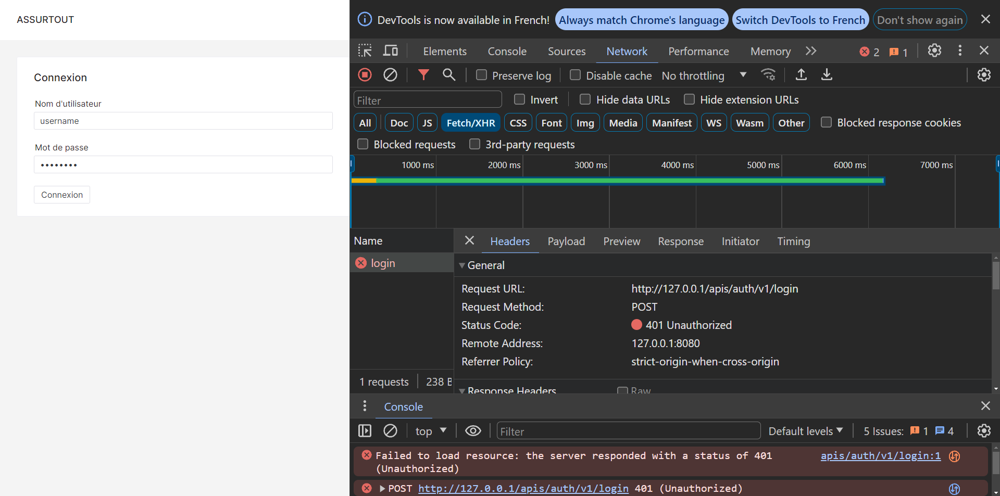
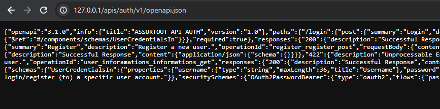
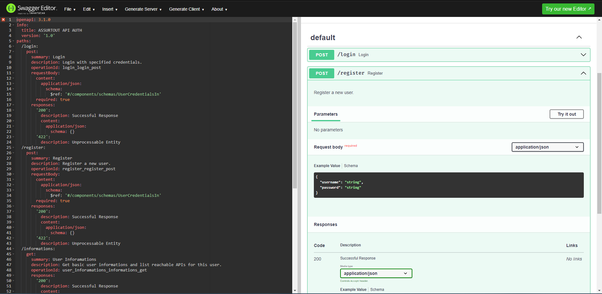
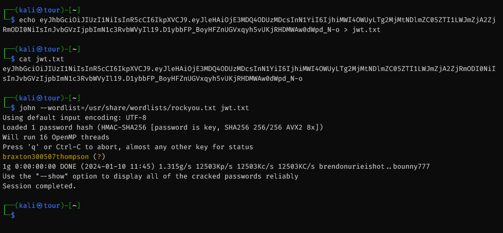
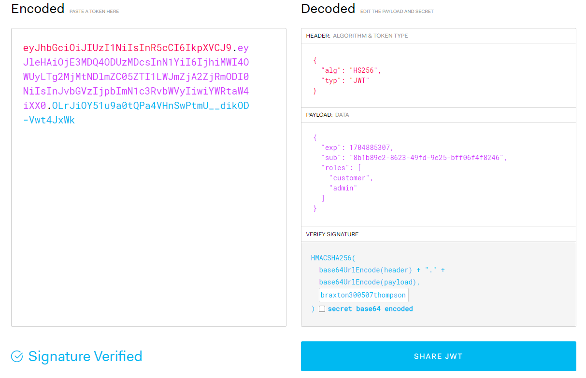
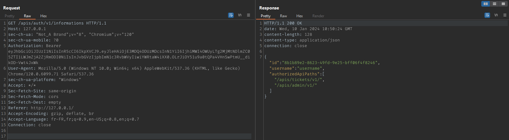
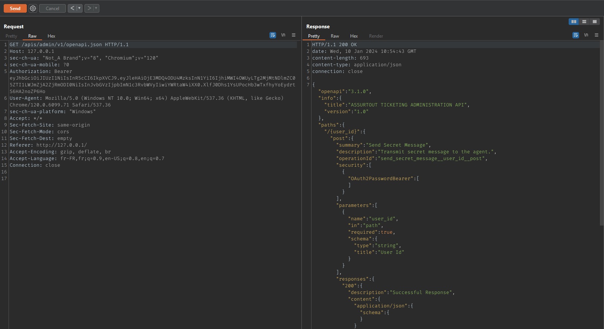
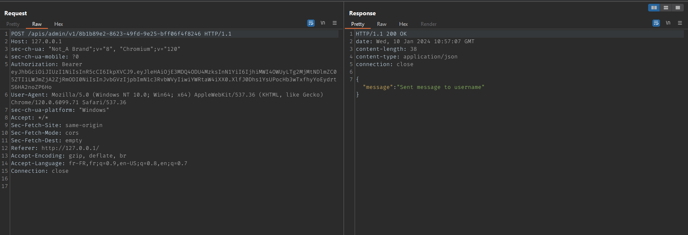
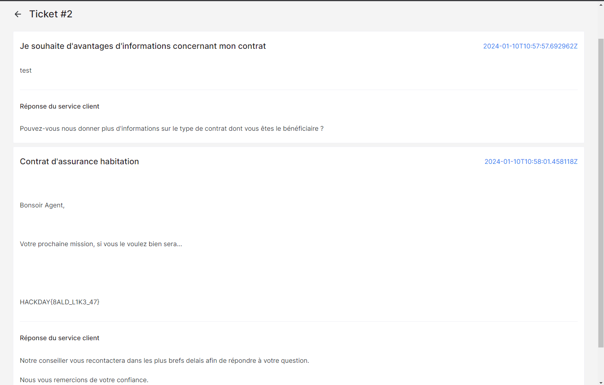

# Solution

Ce challenge est un challenge principalement autour des APIs. Le serveur web sert
plusieurs APIs et un frontend minimal.

## Création d'un compte utilisateur

On arrive sur le front, pas d'interface pour se register, Dans la requête du login, 
on voit des appels à une api : `/apis/auth/v1/`

On sait que la configuration OpenAPI est exposée, on peut donc y accéder via l'url
suivate :
`/apis/auth/v1/openapi.json`.

> **Note :** les urls `/apis/auth/v1/openapi.yml` et `/apis/auth/v1/openapi.yaml`
> renvoient une 301 vers la bonne url du fichier OpenAPI : `/apis/auth/v1/openapi.json`.

On peut parser le fichier OpenAPI avec https://editor.swagger.io/.

On retrouve donc un endoit permettant de s'enregistrer : `/apis/auth/v1/register`.

Nous nous enregistrons.

On peut donc par la suite se connecter (via l'interface ou via `/apis/auth/v1/login`).

L'API nous renvoie un token JWT.

## Attaque du JWT

Nous pouvons par la suite regarder le contenu du JWT (ex : https://jwt.io/)

On voit dans la payload du JWT un Array `roles` qui ne contient que la string
`"customer"`.

Etant donné que le token est chiffré avec un algorithme symétrique nous pouvons essayer
de le bruteforce en offline.

Le mot de passe est faible et est contenu dans rockyou.

Par la suite, nous pourrons ajouter le role `"admin"` et forge ce token avec le secret
retrouvé.

## Accès à l'API d'administration

Si nous regardons dans le fichier OpenAPI de l'API d'authentification nous pouvons
retrouver l'endpoint `/apis/auth/v1/informations` qui nous permet d'énumérer les
APIs qui sont accessibles par l'utilisateur.

Avec le role `"admin"` l'utilisateur a désormais accès à l'API d'administration.

Nous pouvons énumérer les endpoints via le OpenAPI : 

Il suffira à l'agent de répondre à un ticket afin de récupérer le flag : 

